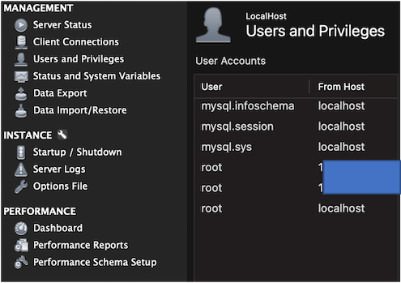

# __music_clustering_recommendation__
Recommend musics using clustering (the project in database class)

---

## __Spotify Million Playlist Dataset__
<br>

source: https://www.aicrowd.com/challenges/spotify-million-playlist-dataset-challenge
<br>

* Challenge dataset

* To predict subsequent tracks, given an initial set of tracks

* Playlists created by users from January 2010 to November 2017

* Simple statistics of dataset
> number of playlists: 1000000
> <br>
> number of tracks: 66346428
> <br>
> number of unique tracks: 2262292
> <br>
> number of unique albums: 734684
> <br>
> number of unique artists: 295860
<br>

You can find more information in
[stats.txt](./spotify_million_playlist_dataset/stats.txt)


---

## __Scraping Data__
<br>

### __1) Create an application in Spotify for Developers__
<br>

* Spotify App Dashboard: https://developer.spotify.com/dashboard/login

* App setting guide: https://developer.spotify.com/documentation/general/guides/authorization/app-settings/

<br>

### __2) Download extracted.mpd.slice data and script__
<br>

* ./extracted_data/extracted.mpd.slice.*.json

* ./spotify_api.py

* ./spotify_config.py

* ./spotify_scraper.py

<br>

### __3) Set up your config.ini__
<br>

* run script below to initialize config file

```bash
python spotify_config.py
```

* set up client_id and client_secret in authentication section of config.ini

```ini
[authentication]
client_id = 3a...1c
client_secret = tv...0x
```

<br>

### __4) Run spotify_scraper.py__
<br>

* refer to help option in spotify_scraper.py

```bash
python spotify_scraper.py --type=artists --all=False
```

<br>

---

## __EDA__
<br>

---

## __Pre-processing__
<br>

---

## __S3 & Athena__
<br>

---

## __MySQL Local Server__
<br>

### __1) Download MySQL Server and Workbench and install them__
<br>

### __2) Create a local instance with Workbench__
<br>

### __3) Grant privileges to users__
<br>



---

## __MySQL Connector__
<br>

---

## __Recommendation System__
<br>

---