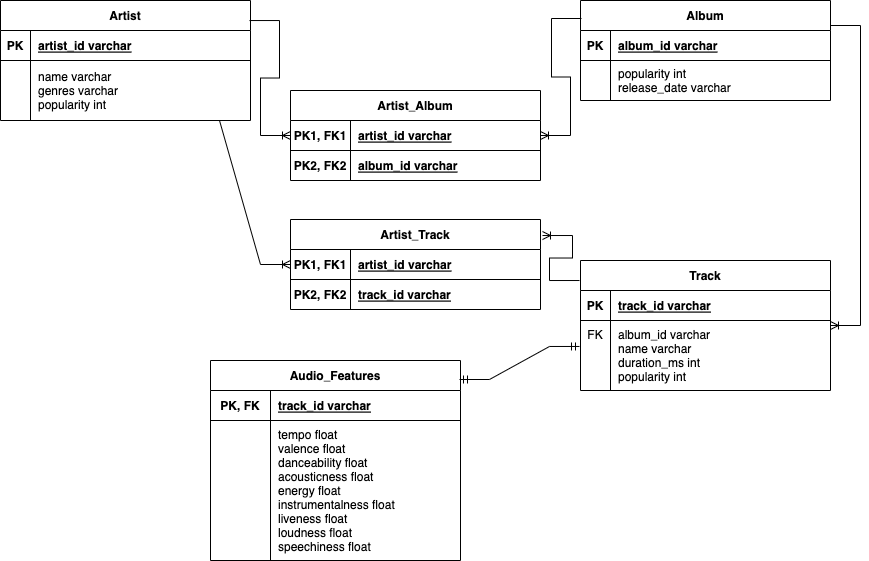
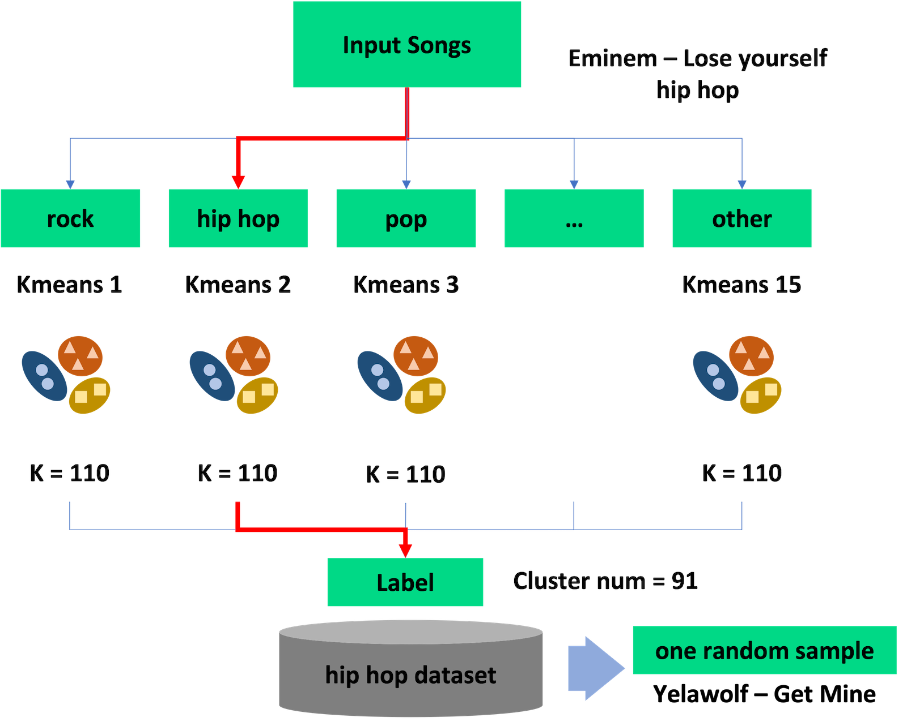
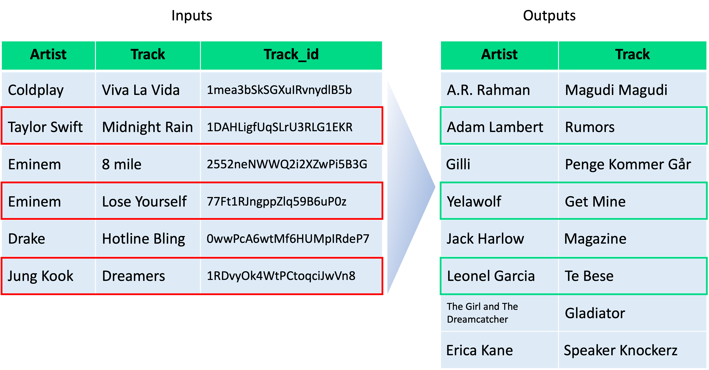

# __music_clustering_recommendation__
Recommend musics using clustering (the project in database class)

---

## __Spotify Million Playlist Dataset__
First, we obtained lists of songs from the Spotify Challenge to build a pool of recommendations and extracted attributes that we needed.
<br>

source: https://www.aicrowd.com/challenges/spotify-million-playlist-dataset-challenge
<br>

* Challenge dataset

* To predict subsequent tracks, given an initial set of tracks

* Playlists created by users from January 2010 to November 2017

* Simple statistics of dataset
>   * number of playlists: 1000000
>   * number of tracks: 66346428
>   * number of unique tracks: 2262292
>   * number of unique albums: 734684
>   * number of unique artists: 295860

You can find more information in
[stats.txt](./spotify_million_playlist_dataset/stats.txt)

* Target attributes
> ***tracks*** - an array of information about each track in the playlist. 
>  * ***track_name*** - the name of the track
>  * ***track_uri*** - the Spotify URI of the track
>  * ***album_name*** - the name of the track's album
>  * ***album_uri*** - the Spotify URI of the album
>  * ***artist_name*** - the name of the track's primary artist
>  * ***artist_uri*** - the Spotify URI of track's primary artist

* Example in ___mpd.slice.*.json___
<br>

```json
"tracks": [
    {
        "artist_name": "Degiheugi",
        "track_uri": "spotify:track:7vqa3sDmtEaVJ2gcvxtRID",
        "artist_uri": "spotify:artist:3V2paBXEoZIAhfZRJmo2jL",
        "track_name": "Finalement",
        "album_uri": "spotify:album:2KrRMJ9z7Xjoz1Az4O6UML",
        "album_name": "Dancing Chords and Fireflies"
    },
    // several tracks omitted
    {
        "artist_name": "Degiheugi",
        "track_uri": "spotify:track:23EOmJivOZ88WJPUbIPjh6",
        "artist_uri": "spotify:artist:3V2paBXEoZIAhfZRJmo2jL",
        "track_name": "Betty",
        "album_uri": "spotify:album:3lUSlvjUoHNA8IkNTqURqd",
        "album_name": "Endless Smile"
    }
]
```
<br>

* Example in ___extracted.mpd.slice.*.json___ (key is track_id)
<br>

```json
{
    "0gKNzy4DOOJ3RFdzVgIAO3": {
        "track_name": "Intro",
        "artist_name": "The Final Goodbye",
        "artist_uri": "4iJGiv1RJKPTWxC6EDAocx",
        "album_name": "Hear Our Praise (EP)",
        "album_uri": "7sGLFZon9ydrWR73N5CLUx"
    },
    // several tracks omitted
    "32OMOC3n7MrscBUgu2V5YV": {
        "track_name": "Greater",
        "artist_name": "The Final Goodbye",
        "artist_uri": "4iJGiv1RJKPTWxC6EDAocx",
        "album_name": "Here",
        "album_uri": "6AnzxZbWBZWZIZScpjps9n"
    }
}
```
<br>

---

## __Scraping Data__
Next, we scraped tracks, artists, albums, and audio-features information for each track using Spotify Web API. For scraping, we needed to issue an authentication token and requested information, dividing ids into small batches.
<br>

### __1) Create an application in Spotify for Developers__
<br>

* Spotify App Dashboard: https://developer.spotify.com/dashboard/login

* App setting guide: https://developer.spotify.com/documentation/general/guides/authorization/app-settings/

<br>

### __2) Download extracted.mpd.slice data and script__
<br>

* ./extracted_data/extracted.mpd.slice.*.json (Files are too big, so we shared them via emails)

* ./spotify_api.py

* ./spotify_config.py

* ./spotify_scraper.py

<br>

### __3) Set up your config.ini__
<br>

* Run script below to initialize config file

```bash
python spotify_config.py
```

* Set up client_id and client_secret in authentication section of config.ini

```ini
[authentication]
client_id = 3a...1c
client_secret = tv...0x
```
<br>

### __4) Run spotify_scraper.py__
<br>

* Refer to help option in spotify_scraper.py

```bash
python spotify_scraper.py --type=artists --all=False
```

* Scraped data
<br>
store scraped data in the format of "id": "response" for each type
<br>
You can check out details in [Spotify Developer's Web API](https://developer.spotify.com/documentation/web-api/reference/#/)

<br>

---

## __Pre-processing__
Many keys of data were unmatched. Simply, we scraped information for around 2,140,000 tracks, but only about 1,470,000 tracks were joined. Furthermore, the scraped data were too big to handle, so we selected songs that had album popularity equal to or greater than 30 and were released in the 2010s. Also, we dropped attributes that are not numerical except the artists' genre. And we flattened JSON files to fit the format of AWS Athena. Thus, we finally got 89,307 tracks for final dataset.

* Final attributes

> ***tracks***
>  * ***track_id***
>  * ***name***
>  * ***album_id***
>  * ***duration_ms*** - the track length in milliseconds
>  * ***popularity***

> ***artists***
>  * ***artist_id***
>  * ***name***
>  * ***genres*** - a list of the genres the artist is associated with. If not yet classified, the array is empty
>  * ***popularity***

> ***albums***
>  * ***album_id***
>  * ***popularity***
>  * ***release_date*** - the date the album was first released

> ***audio-features***
>  * ***track_id***
>  * ***tempo*** - the overall estimated tempo of a track in beats per minute (BPM)
>  * ***valence*** - a measure from 0.0 to 1.0 describing the musical positiveness conveyed by a track
>  * ***danceability*** - how suitable a track is for dancing based on a combination of musical elements including tempo, rhythm stability, beat strength, and overall regularity
>  * ***acousticness*** - a confidence measure from 0.0 to 1.0 of whether the track is acoustic
>  * ***energy*** - a measure from 0.0 to 1.0 and represents a perceptual measure of intensity and activity
>  * ***instrumentalness*** - predicts whether a track contains no vocals
>  * ***liveness*** - detects the presence of an audience in the recording
>  * ***loudness*** - the overall loudness of a track in decibels (dB)
>  * ***speechiness*** - detects the presence of spoken words in a track

<br>

---

## __ERD & Table Schema__
<br>

* ERD
<br>
We declared four main entities, ***Artist***, ***Album***, ***Track***, and ***Audio Features***. As well as relationship ***Releases***, ***Sings***, ***Contains*** and ***Constitutes***. Our final draft of our ER Diagram went as such: The ***Artist*** entity ***Releases*** ***Album*** which ***Contains*** ***Track*** that ***Constitutes*** ***Audio Features***. Especially ***Audio Features*** is the weak entity. Furthermore, we used thick lines because all instances of entities have to participate.


<br>

* Table Schema
<br>
In creating our tables, we renamed the ***Releases*** and ***Sings*** relationships to ***Artist_Album*** and ***Artist_Track*** accordingly. These tables then held the foreign keys for ***Artist***, ***Album***, and ***Track*** as they connected the two pairs of tables together. These two tables are helpful to store many to many relationships.



---

## __S3 & Athena__
To import data to MySQL Server, we converted JSON files to CSV files with AWS Athena.
<br>


<br>

---

## __MySQL Local Server__
<br>

### __1) Download MySQL Server and Workbench and install them__
<br>

### __2) Create a local instance with Workbench__
<br>

### __3) Create tables and import data__
<br>

---

## __MySQL Connector__
<br>

---

## __EDA__
We analyzed data by plotting histograms. As you can see below, we cut off tracks that were released before 2010 and has album popularity lower than 30. You can find more information in [eda_and_make_source_data.ipynb](./eda/eda_and_make_source_data.ipynb)
<br>

|                                        |                                            |                                             |
|:--------------------------------------:|:------------------------------------------:|:-------------------------------------------:|
||||
|    |           |      |
||          |     |
|    ||         |

---

## __Recommendation System__
<br>

* K-Means Clustering
<br>
Since we don’t have any users’ log data, we cannot recommend songs based on their preferences. So instead, we intended to recommend tracks with only their metadata and audio features. We created K-Means clustering models by each genre. Without genres, the recommendation would be too random. We assumed that users at least wanted to get freshness within the genres of that songs. However, Spotify provides us only an artist’s genres, not ones of the track. It is reasonable because it is hard to define the genre of songs these days. So instead, we used the artists’ genres, and there can be several artists in one track. Also, one artist can be categorized into several genres. Thus, one track can have many genres, meaning one track can be used more than once to build the models. In addition, Spotify provides a lot of subgenres, so we must group them into larger categories. We selected 15 genres: rock, hip hop, pop, jazz, blues, country, metal, reggae, folk, soul, EDM, dance, Latin, funk, and others. And we categorized all genres, for example, putting k-pop into the pop category.

* Model Architecture
<br>
We should use different scales and the number of clusterings in each model because we built models by each genre. After training models with scikit-learn package, we can label all tracks with specific clustering numbers in each model. Therefore, when new input songs come into the system’s entrance, it gives them to corresponding models. Then, we get predicted clustering numbers and can call related datasets. Finally, we select one random sample from datasets, as shown in below figure. In addition, the example in figure recommends only one track, but if the input song has several genres, then the system can recommend several tracks.


<br>

* Test
<br>
We have to select test inputs first. Since we don’t have any performance measurements, our performance depends on users’ listening. Thus, we picked songs that are well-known or recently released. In below figure, we chose Taylor Swift’s Midnight Rain and Jung Kook’s Dreamers, famous artists who recently released albums. Also, we decided on Eminem, Coldplay, and Drake’s songs, expecting the system to recommend tracks with similar moods because their music styles are very bold.
<br>
During prediction, we assumed we already knew the track_ids, but we need information on those new inputs. Thus, we requested the data to Spotify API first. Also, we called the Python scaler object and rescaled the test set’s features. Finally, we got eight tracks recommended. Due to randomness, we got songs that have different language lyrics. Among recommendations, we found that three songs have similar moods: Taylor Swift’s Midnight Rain and Adam Lambert’s Rumors, Eminem’s Lose Yourself and Yelawolf’s Get Mine, and Jung Kook’s Dreamers and Lionel Garcia’s Te Bese.



---